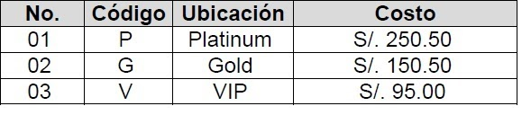

# Practica 1 

Debe usar POO(Patrones) y Programación funcional para todos los casos.
Una empresa organiza eventos tecnológicos con cierto nivel de frecuencia. Cuando se
realiza un evento siempre
tiene un título, la duración del mismo, el nombre del expositor, la hora de ingreso, la hora de
salida y si esta en temporada alta o no. El costo de las entradas depende de la ubicación
según la tabla adjunta.
Los expositores tienen código, nombre, apellidos, sueldo y correo, los asistentes al evento
tienen código, nombre, apellidos, correo, teléfono y dirección.
Observación:
Para este caso se debe tener en cuenta que un evento solo debe tener un expositor y
muchos asistentes. Un asistente solo puede ingresar a un evento.
Cree una aplicación Java con su apellido paterno.
1. Preparando ambiente desarrollo (10 puntos)
a. (2 puntos) Cree un paquete útil y dentro generar en la clase MisConstantes tres
constantes de clase con la nomenclatura correspondiente, de acceso público que tengan los
valores de los costos por ubicación. Opcionalmente puede usar ENUMs.
b. (2 puntos) Genere el modelo de clases de dominio del negocio con los constructores y los
métodos de acceso de todas . Estas clases deben estar en el paquete entidades. Se
revisará su nivel de abstracción. Use patrón Builder.
c. (2 puntos) Genere un método en la clase Evento que use valores generados para
establecer el costo de ingreso al evento dependiendo del código ingresado del evento.
d. (2 puntos) Genere un método que calcule Monto total a pagar incluyendo el IGV, para
esto use una constante previamente definida en la clase constantes.
e. (2 puntos) Genere un método que calcule el monto de descuento que debe ser de 10% en
temporada baja y 5% en temporada alta.
2. Preparando ambiente pruebas (10 puntos)
a. Genere una clase Prueba01 en un paquete pruebas en donde pueda crear objetos del
tipo evento, agregue valores a sus atributos y muestre un listado de los eventos ordenados
por titulo de manera descendente, el expositor y sus asistentes.
b. Genere una clase Prueba02 que muestre la lista de eventos y sus precios, agrupados por
ubicación.
c. Genera una clase Prueba03 que muestre la lista de eventos y el total recaudado por cada
evento.
d. Genera una clase Prueba04 que muestre la lista asistentes que hayan pagado en
Platinum, Gold y VIP.
e. Genera una clase Prueba05 que muestre el sueldo a apagar a todos los expositores que
dieron charlas en VIP.

 
